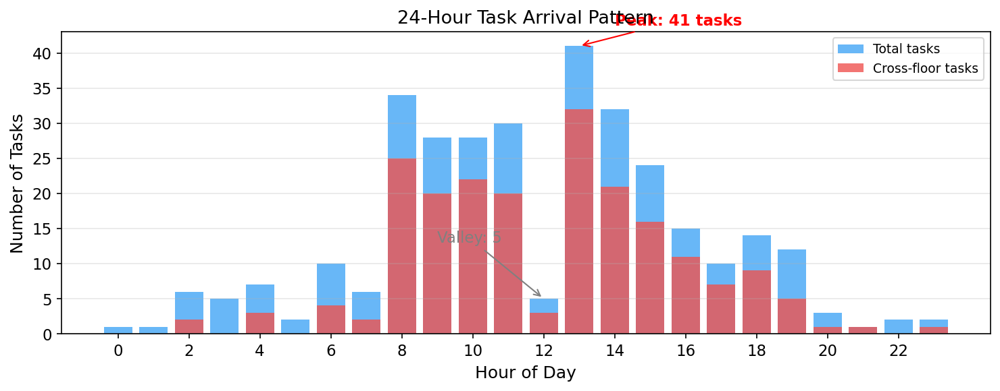
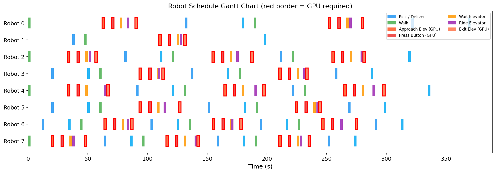
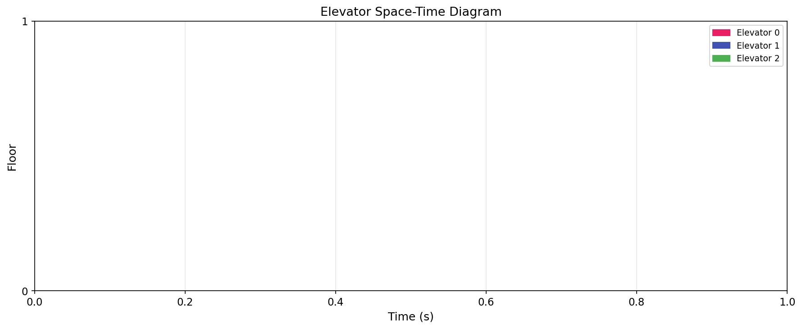
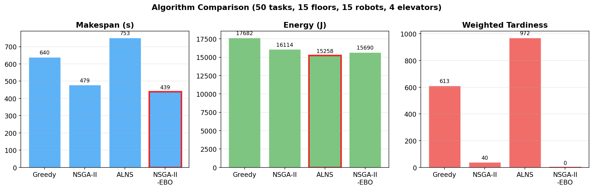
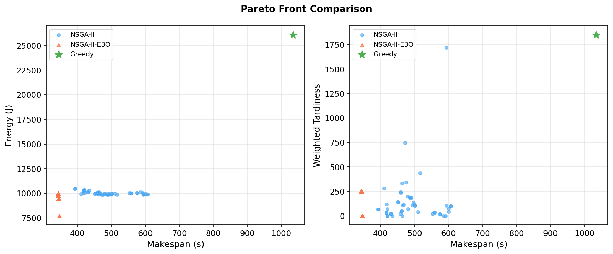
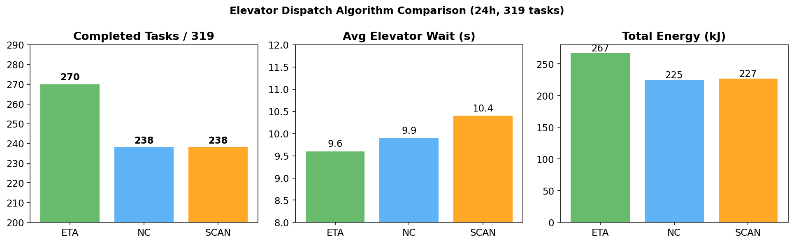
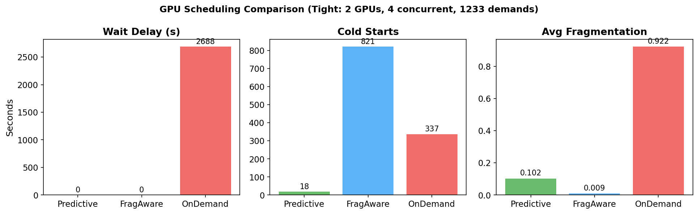

# 面向多楼层场景的多机器人协同配送与计算资源调度

## 1 问题背景

城市高层建筑（电商仓库、写字楼、医院）中，末端配送依赖机器人跨楼层运送货物。这一场景同时涉及三类资源竞争：

- **电梯**：机器人跨楼层的唯一通道，容量有限，由楼宇群控系统统一调度
- **机器人**：异构车队，载重、速度、续航各不相同
- **云端GPU**：机器人按电梯按钮时需要单目深度估计推理，GPU显存有限

本研究将问题分解为两个串联模块：

```
模块1：配送调度                          模块2：GPU资源调度
(任务分配 + 电梯交互 + 路径)     →      (推理任务分配 + 迁移 + 预测)
输出：机器人动作时间线                    输入：动作时间线中的GPU需求段
```

---

## 2 系统建模

### 2.1 物理环境

| 要素 | 建模方式 |
|------|---------|
| 楼宇 | F层（5–20），每层设有取货站和送货站 |
| 楼层功能 | 底层收货、中层存储、高层打包发货 |
| 楼层间连接 | 仅通过电梯，无楼梯通行 |
| 站点距离 | 楼层内站点间距30m，站点到电梯大厅50m |

### 2.2 机器人建模

三种异构机器人：

| 类型 | 载重 | 速度 | 续航 | 能耗系数 | 占比 |
|------|------|------|------|---------|------|
| 重载型 | 80kg | 0.8m/s | 3000m | 5.0 J/m | 30% |
| 标准型 | 30kg | 1.5m/s | 2500m | 3.0 J/m | 50% |
| 快递型 | 10kg | 2.5m/s | 2000m | 2.0 J/m | 20% |

机器人执行跨楼层配送的完整动作序列：

```
走路 → 接近电梯(★GPU) → 按按钮(★GPU) → 等电梯 → 乘电梯 → 出电梯(★GPU) → 走路 → 送货
        8s               7s                        ↑           5s
                                                   群控系统决定
                                                   派哪部电梯
```

带 ★ 的阶段需要云端深度估计推理。乘电梯阶段**不需要GPU**——这个窗口可以释放GPU给其他机器人。

### 2.3 电梯群控系统

真实建筑中，机器人**不选择**电梯。按下楼层呼叫按钮后，群控系统根据派车算法决定派哪一部电梯响应。

本研究实现了三种经典派车算法：

**ETA（预估到达时间最短）**

```
对每部电梯计算到达呼叫层的预估时间：
  ETA = 直达距离/速度 + 中间停站数 × 开关门时间
        + (满载则 +1000s 惩罚)
选 ETA 最小的电梯派出。
```

**SCAN（扫描）**：电梯沿一个方向扫描到头再折返，类似磁盘调度的 SCAN 算法。

**NC（最近电梯）**：选离呼叫楼层距离最近的空闲电梯。

电梯状态机：

```
IDLE → 收到呼叫 → MOVING_TO_CALL → 到达 → DOOR_OPENING
  → 接人 → MOVING_TO_DEST → 到达 → DOOR_OPENING → 放人 → (继续/IDLE)
```

每部电梯独立建模能耗：空载 0.008 kWh/层，满载 0.015 kWh/层。

### 2.4 任务建模

每个配送任务定义为：

```
Task = (起点楼层, 终点楼层, 重量, 优先级, 截止时间, 最早开始时间)
```

优先级分三级：紧急（权重10）、普通（权重3）、批量（权重1）。

### 2.5 24小时周期性任务流

一天内的任务量不是平均的。基于物流园区实际运营模式，定义6个时段：

| 时段 | 时间 | 任务率(/h) | 特征 |
|------|------|----------|------|
| 早班启动 | 06–08 | 8 | 少量补货，同层为主 |
| 上午高峰 | 08–12 | 30 | 大量入库（上行60%） |
| 午间低谷 | 12–13 | 5 | 调拨为主 |
| 下午高峰 | 13–17 | 28 | 大量出库（下行60%） |
| 晚间收尾 | 17–20 | 12 | 中等 |
| 夜间低谷 | 20–06 | 3 | 维护补货 |

实际生成的一天任务分布：



319个任务/天，峰谷比达**8.2倍**（13:00高峰41个 vs 12:00低谷5个）。上午以上行为主（收货→存储），下午以下行为主（存储→发货）。

### 2.6 批量携带与多站送货

机器人可以**一次取多个包裹**（在载重限制内），乘一次电梯，沿途逐层送达：

```
传统（逐个）：取A → 乘电梯 → 送A → 回来 → 取B → 乘电梯 → 送B
批量：        取A+B+C → 乘电梯 → 送A(3楼) → 继续乘 → 送B(5楼) → 送C(5楼)
```

批量判定条件：同一楼层的待取任务、总重量不超过载重上限、任务已到达可取时间。

---

## 3 优化目标

三目标同时优化：

| 目标 | 公式 | 含义 |
|------|------|------|
| **F₁ 最小化完工时间** | max(所有任务完成时间) | 整体吞吐量 |
| **F₂ 最小化总能耗** | 机器人行驶能耗 + 电梯运行能耗 | 运营成本 |
| **F₃ 最小化加权延迟** | Σ 优先级权重 × max(0, 完成时间 − 截止时间) | SLA合规性 |

约束条件：
- 每个任务恰好分配给一台机器人
- 机器人载重不超过上限
- 机器人总行程不超过续航
- 电梯容量限制（每次1–2台机器人）
- 任务时间窗（不早于最早开始时间）

---

## 4 求解算法

### 4.1 精确求解：MILP

用混合整数线性规划建模，适用于小规模实例（≤20任务）。

核心创新——**电梯不相交约束（Disjunctive Scheduling）**：

```
同一部电梯上，任意两次使用 i 和 i' 不重叠：
  要么 i 先于 i'：elev_start[i'] ≥ elev_end[i] + 重定位时间(i→i')
  要么 i' 先于 i：elev_start[i] ≥ elev_end[i'] + 重定位时间(i'→i)
```

这将电梯建模为"不可抢占的机器"（类似 Job-Shop 问题中的机器），精确刻画了电梯竞争。

### 4.2 NSGA-II-EBO（核心算法）

**Elevator-Bottleneck Optimization**：利用电梯瓶颈结构的NSGA-II混合算法。

**问题分析（算法设计依据）**：

通过数学分析发现：
- **电梯是瓶颈**：电梯下界(240s) > 机器人下界(159s)
- **任务间存在冲突**：同楼层任务竞争电梯、重载任务竞争稀缺机器人
- **关键任务**：50kg任务只有4/15机器人能执行，它们的分配决定全局质量

**双层架构**：

```
上层（进化搜索）：              下层（结构优化）：
  决策：任务→机器人分配            决策：每台机器人的任务执行顺序
  编码：gene_assign[N]            方法：权重感知启发式 + 2-opt局部搜索
  搜索空间：O(M^N)               时间：O(N log N) per robot
        ↓                              ↓
  交叉/变异 → 下层优化 → V2群控仿真 → 适应度
```

标准NSGA-II将分配和序列都放在上层搜索（O(M^N × N!)），NSGA-II-EBO将序列优化下放到下层，搜索空间降为 O(M^N)。

**专用算子**：
- 冲突感知交叉：关键任务从更优父代继承，普通任务均匀交叉
- 负载均衡变异：从最忙机器人转移任务到最闲机器人
- 策略参数进化：错峰延迟参数随种群一起优化

### 4.3 对比算法

| 算法 | 类型 | 特点 |
|------|------|------|
| NSGA-II | 多目标进化 | 标准实现，三层编码 |
| ALNS | 大邻域搜索 | 4破坏+3修复算子，自适应权重 |
| Greedy-FCFS | 贪心 | 优先级排序+最近机器人+先到先服务 |

---

## 5 仿真器

基于电梯群控系统的离散时间仿真器（dt=0.5s）：

- 电梯：由群控系统调度，独立状态机，支持多乘客
- 机器人：12种状态，事件驱动的RIDING/WAITING（不用倒计时）
- 批量取货：同楼层多包裹一次取走
- GPU需求标注：自动记录哪些时段需要深度估计
- 24小时连续仿真：支持动态任务到达

仿真输出的机器人调度方案示例：



红色边框的动作段需要GPU推理。可以看到GPU需求是间歇性的——在电梯交互阶段集中出现，行走和乘梯时不需要。

电梯运行轨迹：



每条线段表示一次电梯行程（起点楼层→终点楼层），颜色区分不同电梯。

---

## 6 GPU资源调度（模块2）

### 6.1 问题

机器人按电梯按钮时需要云端深度估计推理（占4–6GB显存），乘电梯时不需要。GPU有限时，多机器人同时需要GPU会产生竞争。

模块2的输入是模块1产生的动作时间线——从中提取GPU需求段和空闲窗口。

### 6.2 预测性调度（PredictiveScheduler）

利用24小时任务周期的**已知模式**提前预测GPU需求：

```
时间 →
需求：  ____████████____████████____
             ↑高峰          ↑高峰
         ↑预加载        ↑预加载
  GPU提前加载模型      GPU提前加载模型
```

三个决策：
1. **预加载**：需求到来前10s开始加载模型到GPU（避免冷启动）
2. **智能保持**：需求间隔短且GPU不紧张时保持分配（避免反复加载/释放）
3. **预释放**：需求稀疏时释放GPU（给其他任务腾空间）

### 6.3 对比策略

| 策略 | 思路 |
|------|------|
| **Predictive** | 预测未来需求 + 预加载 + 智能保持 |
| FragAware | 碎片感知 + 保持/释放决策（不预测） |
| OnDemand | 要了就分，用完就释放 |
| Fixed | 每机器人绑定一张GPU |
| RoundRobin | 轮询分配 |

---

## 7 实验结果

### 7.1 优化算法对比

场景：50任务、15层、15机器人、4电梯。5次独立运行取均值。



| 方法 | Makespan | 能耗 | 延迟 | 求解时间 |
|------|----------|------|------|---------|
| Greedy-FCFS | 640s | 17682J | 613 | <0.01s |
| NSGA-II | 479s | 16114J | 40 | 15s |
| ALNS | 753s | 15258J | 972 | 18s |
| **NSGA-II-EBO** | **439s** | **15690J** | **0** | 34s |

NSGA-II-EBO比标准NSGA-II的Makespan**降低8.3%**，延迟从40降到**零**。ALNS能耗最低但Makespan最差。

### 7.2 Pareto前沿



左图：Makespan vs 能耗；右图：Makespan vs 延迟。NSGA-II-EBO（橙三角）在Makespan维度全面优于NSGA-II（蓝点），Greedy（绿星）被两者支配。

### 7.3 电梯派车算法对比

24小时仿真，319个任务：



| 算法 | 完成率 | 平均等待 | 能耗 |
|------|--------|---------|------|
| **ETA** | **270/319 (85%)** | **9.6s** | 267kJ |
| NC | 238/319 (75%) | 9.9s | 225kJ |
| SCAN | 238/319 (75%) | 10.4s | 227kJ |

ETA完成率最高（+10%），因为它根据预估到达时间选电梯，减少了无效等待。NC能耗最低但完成率不如ETA。

### 7.4 GPU调度对比

紧张配置：2张GPU、4并发上限、1233个需求段（24小时）。



| 策略 | 等待延迟 | 冷启动 | 碎片率 |
|------|--------|-------|--------|
| **Predictive** | **0s** | **18** | 0.102 |
| FragAware | 0s | 821 | 0.009 |
| OnDemand | 2688s | 337 | 0.922 |

Predictive的冷启动只有**18次**（FragAware的2%），因为它提前预加载了模型。OnDemand累积了**45分钟**等待延迟。

### 7.5 24小时全链路

完整一天的端到端结果（15层、20机器人、4电梯、4GPU）：

| 阶段 | 指标 | 值 |
|------|------|-----|
| 任务生成 | 总任务数 | 319 |
| | 跨楼层比例 | 64% |
| | 峰谷比 | 8.2× |
| 配送调度(ETA) | 完成率 | 85% |
| | 平均电梯等待 | 9.6s |
| GPU调度(Predictive) | 等待延迟 | 0s |
| | 冷启动 | 18次 |

---

## 8 创新总结

| # | 创新点 | 相比现有工作 |
|---|--------|-----------|
| 1 | 电梯群控系统建模（ETA/SCAN/NC） | 现有工作中机器人直接选电梯 |
| 2 | NSGA-II-EBO双层结构利用电梯瓶颈 | 标准NSGA-II全黑箱搜索 |
| 3 | 批量携带+多站送货 | 现有工作一次送一个包裹 |
| 4 | 机器人动作驱动的GPU预测调度 | 现有GPU调度不感知机器人状态 |
| 5 | 24小时周期建模+峰谷预加载/预释放 | 现有工作仅做静态批处理 |
| 6 | 电梯disjunctive约束的MILP精确建模 | 现有工作仅用容量约束 |
