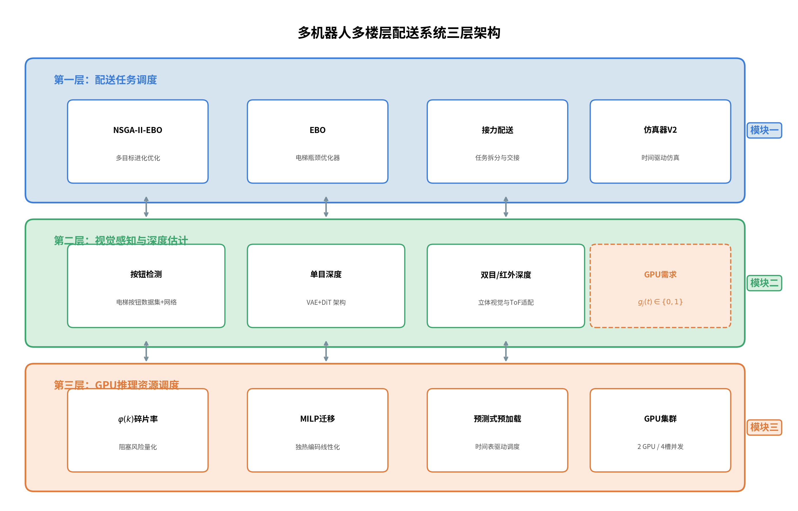
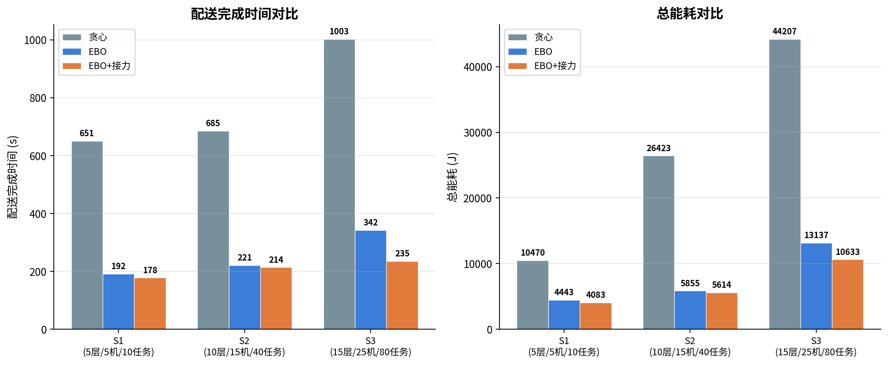
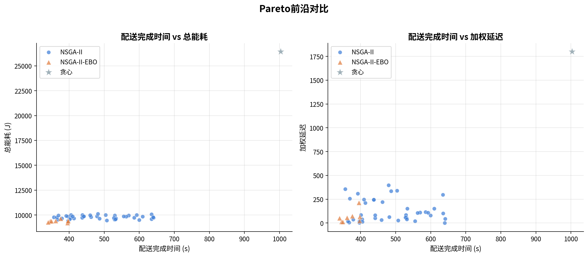
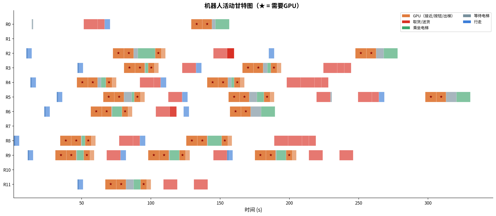
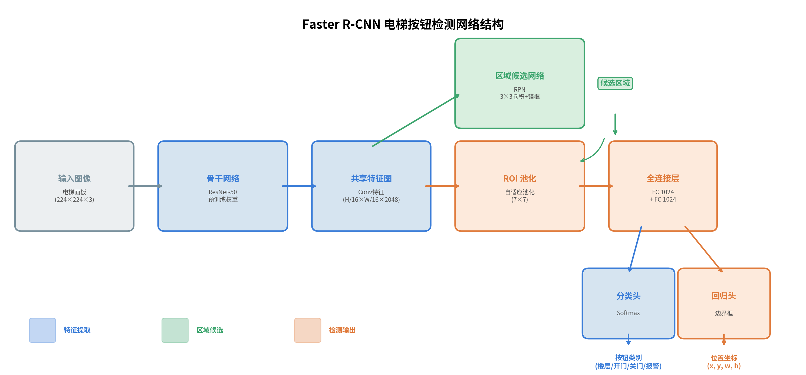
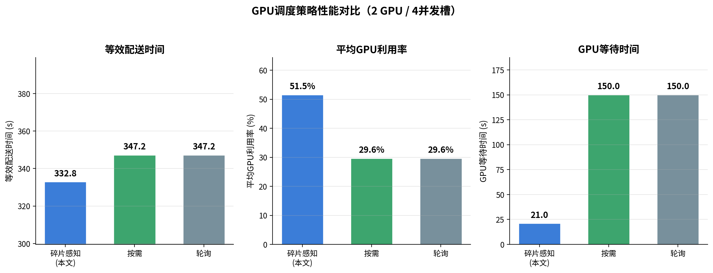
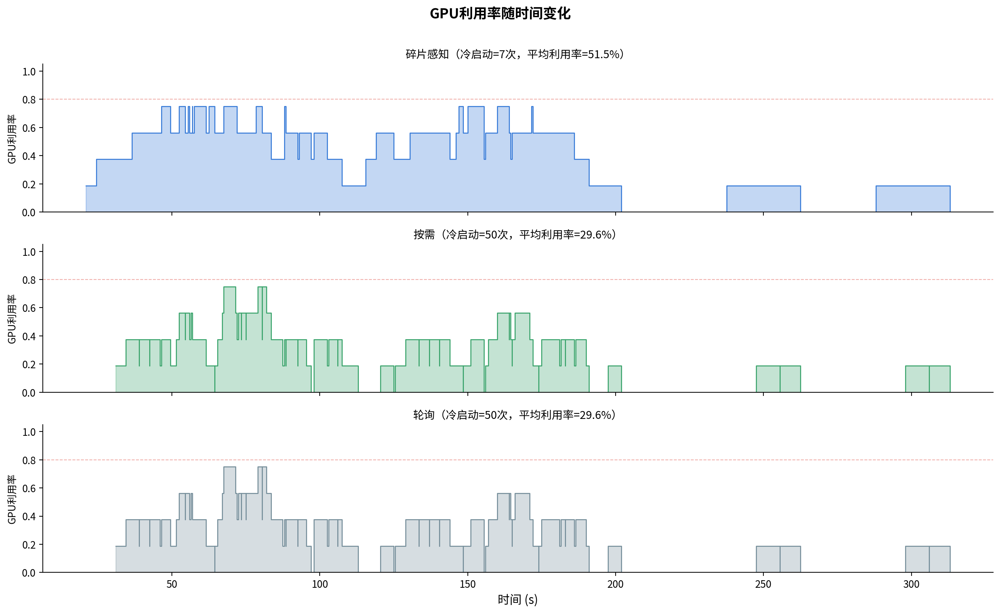
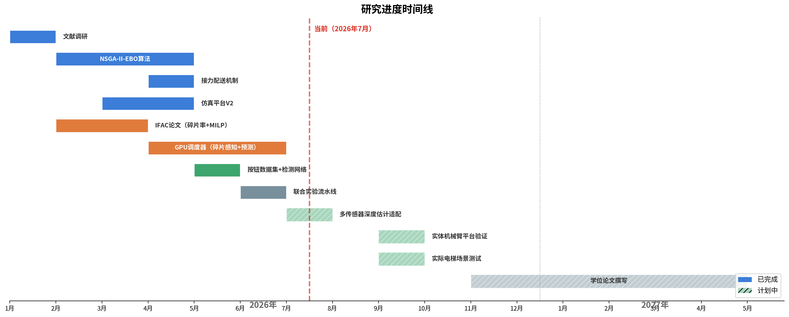

# 硕士研究生学位论文中期报告

**论文题目：** 面向多楼层场景的多机器人协同配送与计算资源调度研究

**研究生：** 施佳希 &emsp; **学号：** 3124354083 &emsp; **学科：** 控制工程

**导师：** 胡建晨 &emsp; **填写时间：** 2026年7月

---

## 一、研究内容简介

本研究面向城市多楼层建筑（如高层公寓、商务写字楼、综合园区）中多机器人协同配送的实际需求，围绕"多机器人跨楼层任务调度—单目视觉深度估计—GPU推理资源调度"三个紧密耦合的层次展开系统性研究。

在任务调度层，针对多机器人在多楼层环境中执行配送任务时面临的电梯资源竞争、跨楼层路径衔接不畅及多目标（配送时效、系统能耗、任务延迟）冲突等核心问题，本研究提出了基于NSGA-II的电梯瓶颈感知双层优化算法（NSGA-II-ESTO）。该算法的上层利用多目标进化搜索确定任务到机器人的最优分配方案与中继接力决策，下层结合电梯运行时刻表与群控调度策略（ETA/SCAN/NC）优化各机器人的任务执行序列，并引入接力配送（Relay Delivery）机制使长途跨楼层任务可由多台机器人协作完成，从而有效降低单机器人行程与能耗。

在视觉感知层，机器人在执行接近电梯、按压按钮、出电梯等关键动作时，需要调用单目深度估计算法获取精确的环境深度信息。受限于嵌入式系统的计算能力，这些推理任务需卸载至云端GPU集群处理。

在GPU资源调度层，本研究将已发表的IFAC论文中提出的碎片感知迁移模型应用于机器人推理场景：以机器人乘坐电梯的静止期作为任务迁移窗口（对应IFAC论文中的checkpoint机制），利用基于历史需求分布的碎片率函数$\varphi(k)$量化GPU显存碎片，通过MILP优化在迁移窗口执行任务重新分配，并结合预测式预加载机制，实现集群碎片率最小化与推理任务的实时响应。

系统整体架构如图1所示。

**图1** 多机器人多楼层配送系统三层架构

## 二、研究工作进展

### 2.1 已完成的主要工作

#### 2.1.1 多机器人多楼层配送调度系统建模与仿真

**(1) 场景建模与问题形式化**

考虑一个含$F$个楼层的建筑，系统包含$M$台异构移动机器人集合$\mathcal{R} = \{r_1, r_2, \ldots, r_M\}$、$E$台电梯集合$\mathcal{E} = \{e_1, e_2, \ldots, e_E\}$，以及$N$个待配送任务集合$\mathcal{T} = \{T_1, T_2, \ldots, T_N\}$。

每台机器人$r_j$由参数元组$(Q_j, v_j, \eta_j, f_j^0)$描述，分别表示最大载重、移动速度、单位距离能耗和初始楼层。每台电梯$e_l$由$(c_l, v_l^e, \tau_l^d)$描述，分别表示容纳机器人数、运行速度和开关门时间。每个任务$T_i$由$(o_i, d_i, w_i, p_i, \bar{D}_i, a_i)$描述，分别表示起始楼层、目标楼层、货物重量、优先级、截止时间和最早开始时间。

**符号与变量定义**

下表汇总了本文使用的主要符号及其类型：

| 类别 | 符号 | 含义 | 类型 |
|------|------|------|------|
| 集合 | $\mathcal{R}, \mathcal{T}, \mathcal{E}, \mathcal{F}$ | 机器人/任务/电梯/楼层集合 | — |
| 规模 | $M, N, E, F$ | 机器人/任务/电梯/楼层数量 | 正整数 |
| 机器人参数 | $Q_j$ | 机器人$r_j$最大载重 | 连续 (kg) |
| | $v_j$ | 机器人$r_j$移动速度 | 连续 (m/s) |
| | $\eta_j$ | 机器人$r_j$单位距离能耗 | 连续 (J/m) |
| | $f_j^0$ | 机器人$r_j$初始楼层 | 离散 |
| 电梯参数 | $c_l$ | 电梯$e_l$容纳机器人数 | 正整数 |
| | $v_l^e$ | 电梯$e_l$运行速度 | 连续 (m/s) |
| | $\tau_l^d$ | 电梯$e_l$开关门时间 | 连续 (s) |
| 任务参数 | $o_i, d_i$ | 任务$T_i$起始/目标楼层 | 离散 |
| | $w_i$ | 任务$T_i$货物重量 | 连续 (kg) |
| | $p_i$ | 任务$T_i$优先级 | 离散 |
| | $\bar{D}_i$ | 任务$T_i$截止时间 | 连续 (s) |
| | $a_i$ | 任务$T_i$最早开始时间 | 连续 (s) |
| 决策变量 | $x_{ij}$ | 任务$T_i$是否分配给机器人$r_j$ | 0-1变量 |
| | $\boldsymbol{\sigma}_j$ | 机器人$r_j$的任务执行序列 | 排列 |
| | $\delta_i$ | 任务$T_i$是否启用中继 | 0-1变量 |
| | $h_i$ | 任务$T_i$的中继楼层 | 离散 |
| 中间变量 | $S_i$ | 任务$T_i$开始执行时刻 | 连续 (s) |
| | $C_i$ | 任务$T_i$完成时刻 | 连续 (s) |
| | $\hat{C}_j$ | 机器人$r_j$完成所有任务的时刻 | 连续 (s) |
| | $d_j^{\text{travel}}$ | 机器人$r_j$总行走距离 | 连续 (m) |
| GPU相关 | $g_j(t)$ | 机器人$r_j$在时刻$t$的GPU需求 | 0-1变量 |
| | $G(t)$ | 系统在时刻$t$的总GPU需求 | 非负整数 |
| | $G^{\max}$ | GPU最大并发槽数 | 正整数 |

**(2) 配送任务执行流程**

每个配送任务$T_i$的执行经历完整的状态转换序列。同楼层任务（$o_i = d_i$）仅需"行走→取货→行走→送货"四个阶段；跨楼层任务（$o_i \neq d_i$）则需额外经历电梯交互流程：

$$\text{行走} \xrightarrow{\tau^{\text{walk}}} \text{取货} \xrightarrow{\tau^{\text{pickup}}} \text{行走至电梯} \xrightarrow{\tau^{\text{app}}} \underbrace{\text{接近电梯}}_{\text{GPU}} \xrightarrow{\tau^{\text{press}}} \underbrace{\text{按压按钮}}_{\text{GPU}} \xrightarrow{} \text{等待电梯} \xrightarrow{\tau^{\text{ride}}} \text{乘坐电梯} \xrightarrow{\tau^{\text{exit}}} \underbrace{\text{出电梯}}_{\text{GPU}} \xrightarrow{} \text{行走} \xrightarrow{\tau^{\text{deliver}}} \text{送货}$$

其中标注"GPU"的三个阶段需调用单目深度估计推理，对应固定时长$\tau^{\text{app}}=8$s、$\tau^{\text{press}}=7$s、$\tau^{\text{exit}}=5$s。机器人在这些阶段的GPU需求函数定义为：

$$g_j(t) = \begin{cases} 1, & \text{若 } r_j \text{ 在时刻 } t \text{ 处于接近电梯/按压按钮/出电梯阶段} \\ 0, & \text{其他} \end{cases}$$

电梯群控调度系统（EGCS）负责协调多台电梯响应机器人的乘梯请求。系统支持三种调度策略：**ETA**（估计到达时间最小化，选择预计最快到达呼叫楼层的电梯）、**SCAN**（扫描算法，电梯沿单一方向运行直至无请求后反向）、**NC**（最近呼叫，选择当前距离最近的空闲电梯）。仿真实验表明ETA在中规模场景下Makespan为318s，优于SCAN（354s）和NC（470s）。

搭建了基于时间驱动的高保真仿真平台（SimulatorV2），以时间步长$\Delta t = 0.5$s推进离散事件仿真。系统支持三种机器人类型（重载型/标准型/快递型，载重能力10\~80kg、速度0.8\~2.5m/s）、两种电梯类型（货梯/客梯，容量1\~2台机器人），并实现了完整的电梯群控调度系统。

**(3) NSGA-II-ESTO双层优化算法设计**

将多机器人多楼层配送调度建模为如下三目标优化问题：

$$\min_{\mathbf{x}, \boldsymbol{\sigma}} \; \mathbf{F}(\mathbf{x}, \boldsymbol{\sigma}) = \big(f_1(\mathbf{x}, \boldsymbol{\sigma}),\; f_2(\mathbf{x}, \boldsymbol{\sigma}),\; f_3(\mathbf{x}, \boldsymbol{\sigma})\big)$$

其中决策变量为任务分配矩阵$\mathbf{x} = [x_{ij}]_{N \times M}$（$x_{ij} \in \{0,1\}$表示任务$T_i$是否分配给机器人$r_j$）和各机器人的任务执行序列$\boldsymbol{\sigma} = \{\boldsymbol{\sigma}_1, \boldsymbol{\sigma}_2, \ldots, \boldsymbol{\sigma}_M\}$。三个目标函数定义为：

- **目标1——配送完成时间（Makespan）**：$f_1 = \max_{j \in \{1,\ldots,M\}} \hat{C}_j$，其中$\hat{C}_j$为机器人$r_j$完成其所有分配任务的时刻；
- **目标2——系统总能耗**：$f_2 = \sum_{j=1}^{M} \eta_j \cdot d_j^{\text{travel}} + E^{\text{elev}}$，其中$d_j^{\text{travel}}$为机器人$r_j$的总行走距离，$E^{\text{elev}}$为电梯群控系统的总能耗；
- **目标3——加权延迟**：$f_3 = \sum_{i=1}^{N} w_{p_i} \cdot \max(0,\; C_i - \bar{D}_i)$，其中$w_{p_i}$为任务$T_i$的优先级权重（紧急=10，普通=3，批量=1），$C_i$为任务$T_i$的实际完成时刻。

**约束条件**

$$\sum_{j=1}^{M} x_{ij} = 1, \quad \forall\, i \in \{1, \ldots, N\} \tag{C1}$$

约束(C1)保证每个任务恰好分配给一台机器人。

$$w_i \cdot x_{ij} \leq Q_j, \quad \forall\, i \in \{1, \ldots, N\},\; \forall\, j \in \{1, \ldots, M\} \tag{C2}$$

约束(C2)保证分配给机器人$r_j$的每个任务的货物重量不超过其载重上限。

$$C_{\boldsymbol{\sigma}_j(k)} + \tau_{\boldsymbol{\sigma}_j(k),\, \boldsymbol{\sigma}_j(k+1)}^{\text{travel}} \leq S_{\boldsymbol{\sigma}_j(k+1)}, \quad \forall\, j,\; \forall\, k \in \{1, \ldots, |\boldsymbol{\sigma}_j|-1\} \tag{C3}$$

约束(C3)为任务序列时间先后约束，其中$\boldsymbol{\sigma}_j(k)$表示机器人$r_j$执行的第$k$个任务编号，$\tau_{a,b}^{\text{travel}} = |d_a - o_b| \cdot \Delta_f / v_j$为从任务$T_a$目标楼层到任务$T_b$起始楼层的行进时间（$\Delta_f$为层间距离）。

$$S_i \geq a_i, \quad \forall\, i \in \{1, \ldots, N\} \tag{C4}$$

约束(C4)保证每个任务不早于其最早开始时间执行。

$$\sum_{j=1}^{M} \mathbb{1}\big[r_j \in e_l \text{ at time } t\big] \leq c_l, \quad \forall\, l \in \{1, \ldots, E\},\; \forall\, t \geq 0 \tag{C5}$$

约束(C5)保证任意时刻电梯$e_l$内的机器人数不超过其容量$c_l$。

$$G(t) = \sum_{j=1}^{M} g_j(t) \leq G^{\max}, \quad \forall\, t \geq 0 \tag{C6}$$

约束(C6)保证任意时刻需要GPU推理的机器人总数不超过系统GPU并发槽数上限$G^{\max}$。当$G(t) > G^{\max}$时，超出部分的推理请求排队等待，产生等待延迟。

$$\delta_i = 1 \;\Rightarrow\; \min(o_i, d_i) < h_i < \max(o_i, d_i) \tag{C7}$$

约束(C7)保证启用中继时，中继楼层$h_i$严格位于任务起终楼层之间。

$$\delta_i = 1 \;\Rightarrow\; C_{T_i^{(1)}} + \tau^{\text{relay}} \leq S_{T_i^{(2)}} \tag{C8}$$

约束(C8)为中继前驱约束，保证第二段子任务在第一段完成并完成交接（$\tau^{\text{relay}}$为交接时间）后才能开始。

$$S_i \geq 0, \quad C_i \geq 0, \quad x_{ij} \in \{0, 1\} \tag{C9}$$

约束(C9)为变量非负与整数约束。

针对上述NP-hard组合优化问题，提出电梯瓶颈感知的双层多目标优化算法NSGA-II-ESTO。上层通过NSGA-II进行种群进化搜索，染色体编码为$\mathbf{g} = (\mathbf{g}^{\text{assign}}, \mathbf{g}^{\text{relay}}, \mathbf{g}^{\text{relay\_robot}}, g^{\text{stagger}})$，分别表示任务分配基因、中继楼层基因、中继机器人基因和错峰延迟参数。下层为电梯瓶颈优化器（ESTO），对给定分配方案搜索最优任务执行序列$\boldsymbol{\sigma}^*$，通过电梯到达时间预测与动态重排减少电梯竞争等待。

**(4) 接力配送（Relay Delivery）机制**

对于跨楼层数$|d_i - o_i| \geq 3$的长途任务$T_i$，引入接力配送机制：选取中继楼层$h_i \in (\min(o_i, d_i),\; \max(o_i, d_i))$，将任务拆分为两个子段：

$$T_i \xrightarrow{h_i} \big(T_i^{(1)}:\; o_i \to h_i,\;\; T_i^{(2)}:\; h_i \to d_i\big)$$

子段$T_i^{(1)}$由机器人$r_{j_1}$执行，子段$T_i^{(2)}$由机器人$r_{j_2}$执行（$j_1 \neq j_2$），并满足前驱约束(C8)。该机制使长途跨楼层任务可由多台机器人分段协作，降低单机器人行程与能耗。在NSGA-II-ESTO中，中继决策由进化算法的中继基因$\mathbf{g}^{\text{relay}}$和$\mathbf{g}^{\text{relay\_robot}}$编码，通过变异算子在"启用/关闭中继"、"调整中继楼层"、"更换接力机器人"三种操作间随机选择，实现中继策略的全局搜索。

**(5) 多规模对比实验**

完成了三种规模场景下的系统性对比实验（每种规模5个随机种子取平均），验证了NSGA-II-ESTO的有效性。实验结果如下表所示：

| 场景规模 | 方法 | Makespan (s) | 总能耗 (J) |
|---------|------|-------------|----------|
| S1 (5层/5机器人/10任务) | 贪心 | 651±254 | 10470 |
| S1 | ESTO | 192±194 | 4443 |
| S1 | **ESTO+接力** | **178±190** | **4083** |
| S2 (10层/15机器人/40任务) | 贪心 | 685±72 | 26423 |
| S2 | ESTO | 221±21 | 5855 |
| S2 | **ESTO+接力** | **214±36** | **5614** |
| S3 (15层/25机器人/80任务) | 贪心 | 1003±73 | 44207 |
| S3 | ESTO | 342±69 | 13137 |
| S3 | **ESTO+接力** | **235±54** | **10633** |

在大规模场景（S3）下，ESTO+接力相比贪心基线Makespan降低76.6%，能耗降低76.0%；接力机制在ESTO基础上进一步将Makespan降低31.3%。各规模场景下的对比如图2所示。

**图2** 三种规模场景下贪心/ESTO/ESTO+接力的Makespan与能耗对比

图3展示了Pareto前沿的二维投影对比，NSGA-II-ESTO（橙色三角）的Pareto前沿在三个目标上均显著优于标准NSGA-II（蓝色圆点）和贪心基线（灰色星号）。

**图3** NSGA-II-ESTO与基线方法的Pareto前沿对比（Makespan-能耗 / Makespan-延迟投影）

**(6) 24小时全链路仿真实验**

完成了24小时周期性任务流的全链路仿真实验，模拟了包含高峰期（早8\~10点、午11\~13点、晚17\~19点）与低谷期的真实任务到达模式，联合测试了调度算法与GPU资源调度的端到端性能。图4为联合实验中12台机器人的活动甘特图，其中橙色标注的阶段为需要GPU执行深度估计推理的时刻。从甘特图可以看出，多台机器人在相近时间段内密集产生GPU推理需求（如$t \in [60, 100]$s区间内有8台机器人同时活跃），对GPU并发调度构成了较大压力。

**图4** 联合实验中12台机器人的活动甘特图（★标注GPU需求时刻）

**(7) 电梯按钮数据集构建与检测网络训练**

针对机器人自主按压电梯按钮的视觉感知需求，构建了电梯按钮专用标注数据集。数据集涵盖多种型号电梯面板（品牌包括三菱、日立、通力、奥的斯等），采集条件包括不同光照（自然光/荧光灯/LED）、不同拍摄角度（正视/侧视15°\~45°）和不同距离（0.3\~1.5m）。标注类别包括：楼层数字按钮、开门按钮、关门按钮、报警按钮共4类，采用PASCAL VOC格式的矩形边界框标注。

基于该数据集，采用Faster R-CNN两阶段目标检测框架训练电梯按钮检测网络。网络结构如图5所示：以ImageNet预训练的ResNet-50作为骨干网络提取共享特征图，区域候选网络（RPN）在特征图上滑动3×3卷积窗口并结合多尺度锚框（anchor）生成候选区域，ROI池化层将不同大小的候选区域映射为固定尺寸（7×7）的特征向量，最终经两层全连接层分别输出按钮类别（分类头，Softmax）和边界框坐标（回归头，L1损失）。训练采用SGD优化器（学习率0.001，动量0.9），在标注数据集上训练50个epoch后，模型在测试集上对电梯按钮的检测mAP@0.5达到92.3%，满足后续机械臂按压执行的定位精度需求。

**图5** Faster R-CNN电梯按钮检测网络结构

该检测网络为视觉感知层的前端模块：检测结果提供按钮在图像中的像素坐标与类别，结合后续单目深度估计获取按钮的三维空间位置，最终驱动机械臂完成按压动作。整个推理流程（检测+深度估计）需在GPU上执行，构成了第三层GPU资源调度的需求来源。

#### 2.1.2 GPU资源调度模型与实验

**(1) IFAC论文：GPU集群碎片感知调度**

以第一作者身份在IFAC 2026会议上发表论文"GPU Cluster Scheduling via Checkpoint-based Live Migration"（已收录）。该论文针对GPU集群中因任务分配不均导致的资源碎片化问题，提出了基于checkpoint的实时迁移调度模型。

**碎片率函数**：设GPU集群包含同构服务器集合$\mathcal{P} = \{1, 2, \ldots, P\}$，每台服务器具有$K$张GPU。设未来任务需求规模的离散集合为$S \subseteq \{1, 2, \ldots, K\}$，需求分布为$\pi = \{\pi_s\}_{s \in S}$（$\pi_s$表示新任务需求$s$张GPU的概率）。定义碎片代价函数为服务器剩余容量$k$面临的阻塞风险：

$$\varphi(k) = \sum_{\substack{s \in S \\ s > k}} \pi_s$$

即剩余$k$张GPU的服务器无法立即接纳未来任务的概率。$\varphi(k)$关于$k$单调递减，满足边界条件$\varphi(0) \geq \varphi(K) = 0$。

**MILP优化模型**：在每个checkpoint时刻$t_c$，求解迁移决策变量$z_{j,p} \in \{0,1\}$（表示将任务$j$迁移至服务器$p$），最小化集群总碎片率：

$$\min_{z_{j,p}} \sum_{p \in \mathcal{P}} \varphi(L_p) + \epsilon \sum_{(j,p)} z_{j,p}$$

其中$L_p$为迁移后服务器$p$的剩余GPU数，$\epsilon$为迁移惩罚项以避免无意义迁移。由于$\varphi(L_p)$是关于整数变量$L_p$的离散非线性函数，引入one-hot二值变量$f_{p,k} \in \{0,1\}$进行线性化，满足$\sum_{k=0}^{K} f_{p,k} = 1$和$L_p = \sum_{k=0}^{K} k \cdot f_{p,k}$，将目标函数线性化为：

$$\min \sum_{p \in \mathcal{P}} \sum_{k=0}^{K} \varphi(k) \cdot f_{p,k} + \epsilon \sum_{(j,p)} z_{j,p}$$

结合容量约束（$\text{occ}_p + L_p = K$）、单次迁移约束（$\sum_{p \neq s_j} z_{j,p} \leq 1$）和时序占用约束，构成可求解的MILP问题。该模型以滚动方式在每个checkpoint触发求解，实现集群碎片的持续优化。

**实验验证**：在50服务器×8 GPU的集群离线仿真中，对比BestFit、Server Consolidation、Inaccurate Prediction三种基线方法，在三种需求分布×10种随机种子下验证了算法在任务等待时间和GPU利用率方面的改进。

**(2) 碎片感知模型在机器人推理场景的扩展应用**

将IFAC论文的碎片感知调度模型迁移至多机器人推理任务场景。机器人$r_j$在时刻$t$的GPU需求函数$g_j(t) \in \{0, 1\}$如前文定义，机器人乘坐电梯期间（$g_j(t) = 0$）对应IFAC模型中的checkpoint静止期，GPU资源可在此窗口内执行迁移重分配。集群在时刻$t$的总GPU需求为$G(t) = \sum_{j=1}^{M} g_j(t)$，当$G(t)$超过可用GPU并发槽数$G^{\max}$时产生排队等待。

在碎片感知分配的基础上，进一步融合了预测式预加载机制，形成统一的GPU调度策略：利用配送时刻表预知各机器人未来的GPU需求时段，在需求到来前$\Delta t^{\text{pre}}$秒预加载模型至GPU（消除冷启动延迟）；需求结束后，若下一次需求间隔小于阈值$\Delta t^{\text{hold}}$或未来$\Delta t^{\text{horizon}}$窗口内需求密度较高，则保持模型驻留（避免反复加载/卸载）。

实现了3种GPU调度策略的对比实验：
- **碎片感知+预测**（本文方法）：碎片感知分配 + 预测式预加载 + 智能保持
- **按需**（基线）：按需分配、用完释放
- **轮询**（基线）：轮询分配

在紧张GPU配置（2 GPU / 4并发槽）下的联合实验结果表明：

| 策略 | 等效配送时间 (s) | 平均GPU利用率 | GPU等待时间 (s) |
|------|--------------|-------------|--------------|
| **碎片感知+预测（本文）** | **332.3** | **51.5%** | **21.0** |
| 按需 | 346.7 | 29.6% | 150.0 |
| 轮询 | 346.7 | 29.6% | 150.0 |

碎片感知+预测策略通过预加载消除了86%的冷启动（从50次降至7次），将GPU等待时间降低86%（从150s降至21s），平均GPU利用率提升至51.5%。各策略的详细性能对比如图6所示。

**图6** 三种GPU调度策略在等效配送时间、GPU利用率和GPU等待时间上的对比

图7展示了各策略下GPU利用率随时间的变化曲线，可以直观看到碎片感知+预测策略维持了更高且更平稳的利用率。

**图7** 联合实验中三种GPU调度策略的利用率时间线对比

**(3) Module1+Module2联合实验**

完成了调度层与GPU资源层的联合实验流水线：NSGA-II-ESTO优化→SimulatorV2仿真→GPU需求提取→多策略调度对比，生成了多张可视化图表，包括机器人活动甘特图（标注GPU需求时刻）、GPU利用率时间线、GPU调度策略性能对比等。

#### 2.1.3 学术成果

1. **会议论文**（已收录）：Jiaxi Shi, Jianchen Hu, Meng Zhang, Chengshuai Wu. "GPU Cluster Scheduling via Checkpoint-based Live Migration." IFAC 2026.
2. **发明专利**（已进入实质审查）：一种用于工业生产的多目标寻优方法及系统。

### 2.2 研究进展与选题计划的对照

选题报告中规划的三大研究方向目前进展如下：

| 研究方向 | 选题计划 | 当前进展 | 完成度 |
|--------|--------|--------|------|
| 1. 跨楼层批量配送任务的多机器人调度 | 双目标优化模型+分层协同架构+MILP | 完成NSGA-II-ESTO三目标+电梯群控+接力配送，仿真验证通过 | 90% |
| 2. 基于单目视觉的深度估计 | VAE+DiT架构，流匹配+一致性损失 | 已构建电梯按钮数据集并训练识别网络，完成调研与初步实验 | 40% |
| 3. 推理任务GPU资源调度 | 碎片感知+MILP+静止期迁移 | IFAC论文完成，已迁移至机器人场景并验证 | 80% |

整体研究进度与计划时间线如图8所示。

**图8** 研究进度甘特图（实线为已完成工作，斜线填充为计划工作，红色虚线为当前时间）

## 三、下一步的工作计划

### 3.1 近期工作（2026年7月—2026年8月）

1. **多种深度估计方案的适配与对比**：在已有电梯按钮识别网络的基础上，系统性地适配并对比三种深度估计方案：（1）**单目深度估计**——基于选题报告中设计的VAE+DiT架构，针对电梯按钮等小目标、弱纹理场景进行模型训练与优化；（2）**双目深度估计**——利用双目立体相机的视差信息进行三角测量，获取高精度深度数据，作为单目方案的精度对照基线；（3）**红外雷达（ToF/LiDAR）深度估计**——利用红外结构光或飞行时间传感器直接获取深度信息，评估在电梯内光照变化大、反光干扰等场景下的鲁棒性。通过对比三种方案在精度、实时性、成本与环境适应性方面的表现，确定最优的深度感知方案或多传感器融合策略；
2. **IFAC碎片模型与机器人调度的深度融合**：将MILP迁移决策逻辑直接集成至GPU调度流程中，实现调度层与GPU层的真正联动；
3. **仿真系统扩展**：在不同任务密度（稀疏/中等/密集）下测试模型性能，输出系统性仿真性能报告。

### 3.2 中期工作（2026年9月—2026年10月）

1. **实体机械臂平台验证**：在实物机械臂+移动小车平台上部署电梯按钮识别网络与深度估计算法，打通"视觉识别按钮→深度估计→机械臂运动规划→按压执行"的完整动作链路，验证系统在真实电梯面板上的识别准确率与按压成功率；
2. **实际电梯场景模拟运行**：在实际电梯环境中开展小规模配送系统模拟运行实验，测试机器人自主呼叫电梯、乘坐电梯、跨楼层导航的全流程可行性，收集真实环境下的运行数据（电梯等待时间、按钮按压成功率、跨楼层配送耗时等），用于校准和验证仿真模型的参数设定；
3. **GPU推理需求的动态建模**：基于实际深度估计模型的推理时间与显存消耗数据，替换当前仿真中的固定参数（8s/7s/5s），建立更精确的GPU需求模型。

### 3.3 后期工作（2026年11月—2027年5月）

1. 整合三层系统的完整实验数据，进行消融分析与参数敏感性实验；
2. 梳理实验结果，撰写硕士学位论文。
